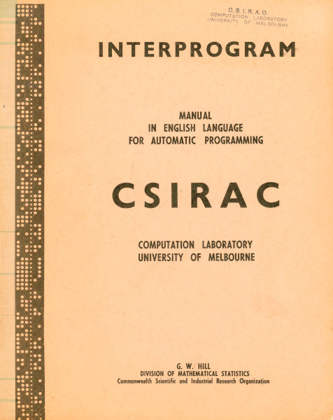

INTERPROGRAM - Australia's First High-Level Programming Language
================================================================

INTERPROGRAM was developed by Geoff Hill in 1960 for the
[CSIRAC](https://en.wikipedia.org/wiki/CSIRAC), Australia's first
electronic stored program computer and the only first-generation
computer to survive intact to this day.

INTERPROGRAM is an interpreted high-level programming language, advertised as
"English Language for Automatic Programming".  The syntax is very easy
for beginners to programming to learn.

Here is the original cover for the manual (click for a larger version):

By the way, the paper tape down the left-hand side reads as follows in
Flexowriter teleprinter codes:

    WAFFLE FOR THE COVER OF THE INTERPROGRAM MANUAL 1/10/60.

This message is followed by some carriage returns and then the
message repeats.  Easter eggs go way back!

## Historical context

A lot of innovation in programming languages was happening around 1960.
Here are a few of the languages from that era (not an exhaustive list):

* 1957: Fortran
* 1958: ALGOL-58
* 1959: COBOL
* 1960: <b>INTERPROGRAM</b>
* 1960: Lisp
* 1960: ALGOL-60
* 1963: BASIC

INTERPROGRAM was inspired a little by Fortran, which was becoming popular
in the scientific community at the time.  INTERPROGRAM can be viewed as the
parts of Fortran that were able to fit on the memory-limited CSIRAC.

Crucially, INTERPROGRAM has a "beginner's language" feel to it, but was
invented three years before BASIC.  The use of "English language" constructs
makes INTERPROGRAM very easy to learn.

## Is it really "Programming in English"?

Yes and no.  Obviously, the CSIRAC did not have the capability to parse
freeform natural language.  The syntax of INTERPROGRAM was formalised,
but designed to read like regular English.

The essence of teaching a beginner to program is teaching them to break the
problem down into primitive steps, and then tell the computer to do each of
those steps.  The final language doesn't matter: Fortran, INTERPROGRAM, C,
Python, Java, Rust, etc are all just syntactic details.  The goal is the same.

Take a simple computation: "set z to the square root of (x2 + y)".
Let's write out the primitive steps of the computation in plain English:

1. Take the value of x.
2. Multiply it by itself.
3. Add the value of y.
4. Form the square root of the result so for.
5. Replace the contents of the variable z with the final result.

That is how you would perform the computation with pencil and paper.
Here is what it looks like in INTERPROGRAM:

    TAKE X
    MULTIPLY BY THIS
    ADD Y
    FORM SQUARE ROOT
    REPLACE Z

That's almost the same as the pencil and paper version!

Here is another example of replacing X with the absolute value of X:

        TAKE X
        IF THIS IS POSITIVE, GO TO *1
        MULTIPLY BY -1
    *1  REPLACE X

This is the key to INTERPROGRAM's syntactic style: let the plain English
description of the algorithm inform how the code is written.  The
code should read the way it is written.  And don't be afraid to use
multiple words if it makes the code easier to read aloud; for example,
"MULTIPLY BY" and "FORM SQUARE ROOT", not "MULTIPLY" and "SQRT".

INTERPROGRAM can seem verbose at times, but there are ways to reduce
the verbosity.  See the [Extended Language Reference](doc/reference.md)
for more information.

INTERPROGRAM has a short mental distance between "what do I want to do?"
and "how do I tell the computer to do it?".  Excellent for beginners.
Don't believe me?  Check out the programs in the "examples" directory and
see if you can read them!

## What is this project?

There is a [CSIRAC emulator](https://cis.unimelb.edu.au/about/csirac/emulator)
available on the Internet that can run the original INTERPROGRAM environment,
but the CSIRAC was very limited.  See [this page](doc/CSIRAC-history.md) for
the technical specifications and history.

I was curious what a modern implementation of INTERPROGRAM would look like,
to explore the language and its possibilities.

I also wanted to speculate on what would the language have evolved into
had it continued to be developed by the Australian computer community.
What if it had become the standard "BASIC" for Australia?  What might it
have looked like after several decades of improvement?

Yes, I extended the language but I have tried to keep the original
design philosophy as much as possible.  If you want a purer experience,
then pass the <tt>--classic</tt> option to the interpreter to force the
use of the original syntax.

## Manual

The original [manual for the INTERPROGRAM language](doc/INTERMAN.pdf)
is in this repository for reference.  The original version of the
manual came in Word format from [this CSIRAC emulator](https://cis.unimelb.edu.au/about/csirac/emulator).

I have made some editorial improvements to the manual, formating program
statements in a monospaced font, adding some cover page images
from the Museums Victoria website, and adding a table of contents.

The syntax for my implementation of "Extended INTERPROGRAM" is described
in the [Extended Language Reference](doc/reference.md).

## Building

The source code is designed to be built using cmake.  To build and run the
automated tests:

    mkdir build
    cd build
    cmake ..
    make
    make test
    sudo make install

Then to run some examples:

    interprogram examples/classic/hello_world.ip
    interprogram examples/classic/3dplot.ip
    interprogram examples/classic/matches.ip
    interprogram examples/extended/matches.ip

## Was it used back in the day?

Absolutely, yes!  The following quote is from the book <i>The Last of the First,
CSIRAC: Ausralia's First Computer</i>, by Doug McCann and Peter Thorne, 2000,
ISBN 978-0-73-405168-4.  On page 30:

> Hill went on to develop a simple ‘English language’ code for CSIRAC called ‘INTERPROGRAM’. This was introduced in 1960 and was an automatic interpretive language which greatly simplified programming for users; following its introduction most clients adopted it because it was much more ‘user-friendly’ than the standard CSIRAC machine code and a more efficient use of their time.

and on page 66:

> Later on when INTERPROGRAM – the programming language developed by Geoff Hill – was adopted, many of the ordinary users used that. It was much more friendly than trying to write optimised code for CSIRAC, so the average user tended to use it. It wasn’t as efficient from a computing point of view, but it was a much more efficient use of their time. They didn’t have to learn the idiosyncrasies of this machine. They didn’t need to be super programmers, they just wanted to get a job done, so INTERPROGRAM courses were provided for them.

The book contains many more quotes from people who used INTERPROGRAM in
their work.

## License

MIT License.

## Contact

For more information on this project, to report bugs, or to suggest
improvements, please contact the author Rhys Weatherley via
[email](mailto:rhys.weatherley@gmail.com).

## <tt>END OF INTERPROGRAM README</tt>
