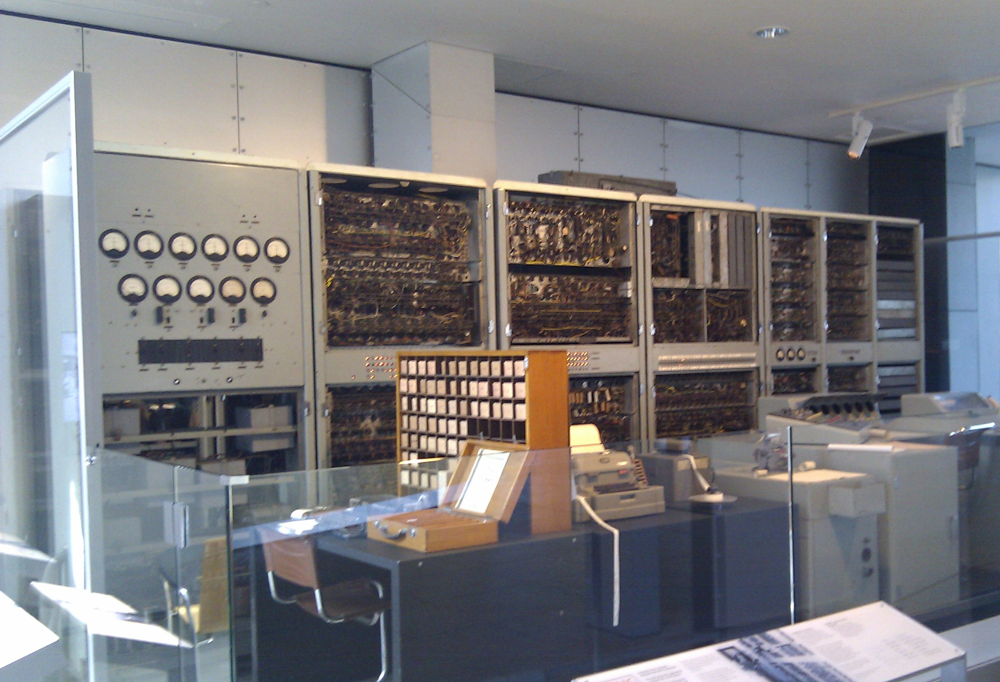

CSIRAC History
==============

Note: Much of this information comes from the book <i>The Last of the First,
CSIRAC: Ausralia's First Computer</i> by Doug McCann and Peter Thorne, 2000,
ISBN 978-0-73-405168-4.

CSIRAC (originally the "CSIR Mk1") was constructed by a team led by
Trevor Pearcey and Maston Beard, running its first test program in 1949.
It saw almost continuous use at the CSIR Division of Radiophysics in
Sydney and then at the University of Melbourne, until it was finally
shut down in 1964.

Technical specifications of CSIRAC:

* Clock speed of approximately 1000 instructions per second.
* 20-bit words which flowed through the machine using a 1-bit serial design.
* 768 words of mercury delay line memory for main "RAM".
* Up to 4096 words of magnetic drum memory for additional storage.
* Programs were entered on 12-hole paper tape.
* User data was input or output on 5-hole paper tape, or through the
  use of a teleprinter.

CSIRAC is most famous for being the first computer in the world to
play music.  But obviously, CSIRAC was intended as a scientific instrument
rather than a musical instrument.  Here is some of the science that it did
just at the CSIR Division of Radiophysics:

* Computation of stellar and solar position tables for the Sydney area.
* Extensive computations of molecular analyses for organic chemists.
* X-ray spectra data and Fourier syntheses for crystallographers.
* Analyses of river flood data for the previous century and water
behaviour simulations for the Snowy Mountains Hydroelectric Authority.
* Simulation studies of signal patterns for radio antennae used in
radioastronomy.
* Computations relating to the composition of the ionosphere.
* Studies in road and air traffic congestion.
* Solution of linear equations and matrices for framework structure design.

Up until 1960, CSIRAC programs were written in machine code and punched onto
12-hole paper tape.  The invention of INTERPROGRAM allowed programs to be
written in a high-level programming language.

The user's programs were typed on a Flexowriter teletype, which also
punched the program onto 5-hole paper tape.  The program and any input data
was then fed into the CSIRAC running the INTERPROGRAM compiler/interpreter
environment.

INTERPROGRAM was invented by Geoff Hill, who had been involved in the
CSIRAC design and implementation from the start, working with Trevor
Pearcey on the logical design and instruction set in the late 1940's.
He was one of the primary programmers on the machine during its lifetime.
Geoff passed away in 1982 at the age of 54.

Here is one of my photos of the CSIRAC from when I did my pilgrimage to
the machine in 2012.  It is currently located in the Scienceworks Museum
in Melbourne, Australia.

